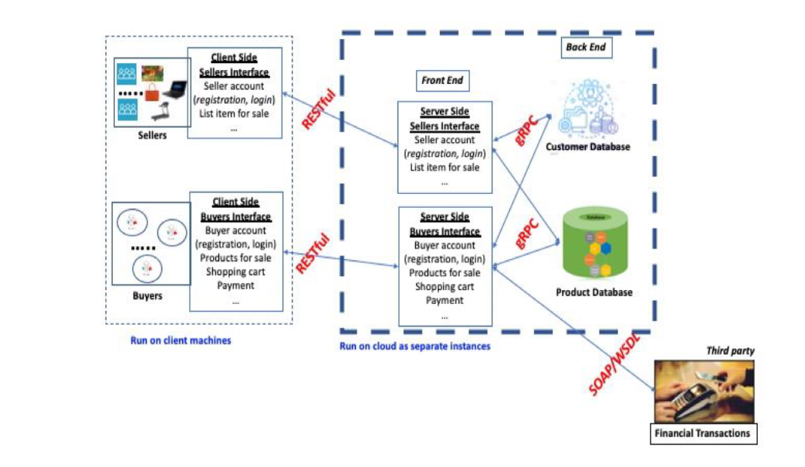

### Overall System Architecture

The system comprises several interconnected components, each serving a specific role in the functionality of the application. The main components include:

- **Buyer Server Frontend**
- **Seller Server Frontend**
- **Buyer Server Backend**
- **Seller Server Backend**

  

The server frontends act as intermediaries, receiving requests from clients and establishing connections with the relevant database instances. The database instances consist of the Product Database and Customer Database, each managed by separate server backends. The flow of a typical request follows this sequence:

**Client** ---*REST Request*---> **Server Frontend** ---*gRPC Request + *---> **Target Backend Functionality** ---*MySQL Request*---> **Database Query**

**Target Backend Functionality** ---*SOAP Request*---> **Financial Server**

The current state of the application effectively supports all the functionalities outlined in the specification document. It operates under certain assumptions:

1. **Database Consistency:** Sellers and their corresponding items are linked through the seller ID, essentially forming a foreign key relationship. However, the application does not automatically handle the deletion of related objects when the reference object is deleted. Deletion is an independent operation performed by the server and may lack consistency in the event of node failure.

2. **Database Service Availability:** The system assumes that the backend database service is consistently operational before starting the server frontend service.

3. **Shopping Cart Handling:** The application assumes that the client is responsible for saving the cart when needed. It only retains changes made to the cart in memory until explicitly saved.

4. **Transaction History:** The user's transaction history is not stored as a timeline but rather as a snapshot of the cart when the "make purchase" functionality is invoked.

5. **Search Mechanism:** The buyer's search functionality attempts to match the existence of the exact keyword as a substring in the concatenated string of all keywords associated with a product.

### Features

#### Client-side sellers interface
- Create an account: sets up username and password
- Login: provide username and password
- Logout
- Get seller rating
- Put an item for sale: provide all item characteristics and quantity
- Change the sale price of an item: provide item id and new sale price
- Remove an item from sale: provide item id and quantity
- Display items currently on sale put up by this seller
  
#### Server-side sellers interface
- Same as Client-side Sellers interface
  
#### Client-side buyers interface
- Create an account: sets up username and password
- Login: provide username and password
- Logout
- Search items for sale: provide an item category and up to five keywords
- Add item to the shopping cart: provide item id and quantity
- Remove item from the shopping cart: provide item id and quantity
- Save the shopping cart
- Clear the shopping cart
- Display shopping cart
- Make purchase
- Provide feedback: thumbs up or down for each item purchased, at most one feedback per purchased item
- Get seller rating: provide seller id
- Get buyer purchase history
  
#### Server-side buyers interface
Same as Client-side buyers interface

### Other 

**Session Timeout**: Clients are logged out automatically if there is no client activity for at least five minutes. Displays a warning message one minute before automatic logout.

**Stateless frontend**: Frontend server components are designed to be stateless. All state is stored in the backend databases (customer and product databases).

**Registration and login**: A very simple mechanism, e.g. store/transport login name and password in clear text. Allow a buyer or server to login and interact with the server from multiple client machines simultaneously.
